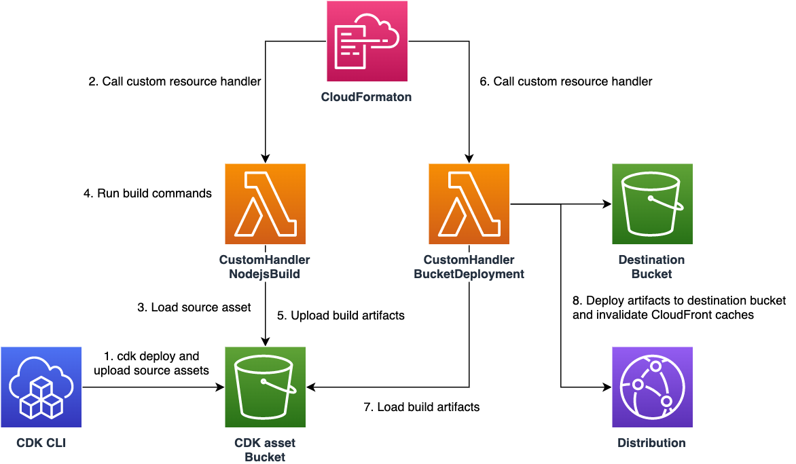

# Deploy-time Build
AWS CDK L3 construct that enables you to build apps during deploy time, which aims to resolve the problem when we deploy frontend apps from CDK.



## Usage
```ts
import { NodejsBuild } from 'deploy-time-build';

declare const api: apigateway.RestApi;
declare const destinationBucket: s3.IBucket;
declare const distribution: cloudfront.IDistribution;
new NodejsBuild(this, 'ExampleBuild', {
    assets: [
        {
            path: 'example-app',
            exclude: ['dist', 'node_modules'],
        },
    ],
    destinationBucket,
    distribution,
    outputSourceDirectory: 'dist',
    buildCommands: ['npm ci', 'npm run build'],
    buildEnvironment: {
        VITE_API_ENDPOINT: api.url,
    },
});
```

Note that you can pass environment variable `VITE_API_ENDPOINT: api.url` to the construct, which is resolved on deploy time, and injected to the build environment (a vite process in this case.)
The resulting build artifacts will be deployed to `destinationBucket` using a [`s3-deployment.BucketDeployment`](https://docs.aws.amazon.com/cdk/api/v2/docs/aws-cdk-lib.aws_s3_deployment.BucketDeployment.html) construct internally.

You can specify multiple input assets by `assets` property. These assets are extracted to a respective sub directory in a temporary directory. For example, assume you specified assets like the following:

```ts
assets: [
    {
        path: 'example-app',
        exclude: ['dist', 'node_modules'],
        commands: ['npm install'],
    },
    {
        path: 'module1',
    },
],
```

Then, the extracted directories will be located as the following:

```sh
.                         # a temporary directory (automatically created)
├── example-app           # extracted example-app assets
│   ├── src/              # dist or node_modules directories are excluded even if they exist locally.
│   ├── package.json      # npm install will be executed since its specified in `commands` property.
│   └── package-lock.json
└── module1               # extracted module1 assets
```

Please check [example directory](./example/) for a complete example. 

## Why do we need this construct?
Previously, there are a few different ways to deploy frontend applications from CDK (1 and 2 below). But none is perfect with different pros and cons. This construct adds another option to deploy frontend apps.

### 1. Deploy depending resources first, then build frontend apps
Deploy depending resources (e.g. backend API or cognito user pools) first, then get required values (e.g. API endpoint or userPoolId) from stack outputs, and build the frontend app locally and deploy it.

This pattern is easy to use but the disadvantages are the following:

1. we cannot define frontend constructs and depending constructs in a single stack
2. we need some operation to get values from stack output and inject it to frontend build process. (e.g. manually copy-paste or run a shell script using CFn API.)

Especially #1 is sometimes annoying when you want to keep you CDK app as simple as possible.

### 2. Use `S3Deployment.Source.data` to inject deploy-time values
Use [`s3-deployment.Source.data/jsonData`](https://github.com/aws/aws-cdk/pull/18659) to store deploy-time values in an S3 Bucket as a file, and load it from apps on runtime. 

In this case we can define both frontend and backend into a single stack and deploy them at once. However, it requires another network request for apps to load those values, which is not very efficient and required additional implementation on app side to support this mechanism. Also, the CDK internal implementation for this feature is somewhat complex (basically it resolves token on the construct's bind time by its own code unlike other constructs) and currently has [cross-stack bugs](https://github.com/aws/aws-cdk/issues/19257) that might be difficult to resolve.

You can see the working example of this pattern [in this repository](https://github.com/aws-samples/nextjs-authentication-ui-using-amplify-ui-with-cognito#deploy-cdk-stacks).

Now, the construct `NodejsBuild` resolves above disadvantages and makes world a better place.

### 3. Deploy-time build
The root cause of the problem is that you cannot know the required values (e.g. API endpoint) unless you deploy the resources, and you cannot build and deploy frontend apps unless you know these values. To resolve this issue, you can build your frontend app during CloudFormation deployment. By this, you can inject deploy-time values such as API endpoint to your frontend build environment and deploy it all at once.

The advantages of this way is:

1. The deploy process can totally be completed inside CDK. No need to use any additional shell script unlike pattern #1.
2. The implementation of frontend is CDK agnostic. You can just use environment variables to inject API endpoint, unlike pattern #2.
3. We can use both single stack strategy as well as multi-stacks strategy, without such complex mechanism as pattern #2.

There are, however, a few considerations to be discussed when you use this constuct. Please check the next section.

## Considerations
Since this construct builds your frontend apps every time you deploy the stack and there is any change in input assets (and currently without any "smart" build cache!), the time deployment takes tends to be longer (e.g. a few minutes even for the simple app in `example` directory.) This might results in worse developer experience if you define this construct and other resources (e.g. backend API) in a single stack and you change both frontend and backend code frequently (imagine `cdk watch` deployment always re-build your frontend app). Considering that, it is recommended that you create a separate stack for your frontend app especially in development environment.
